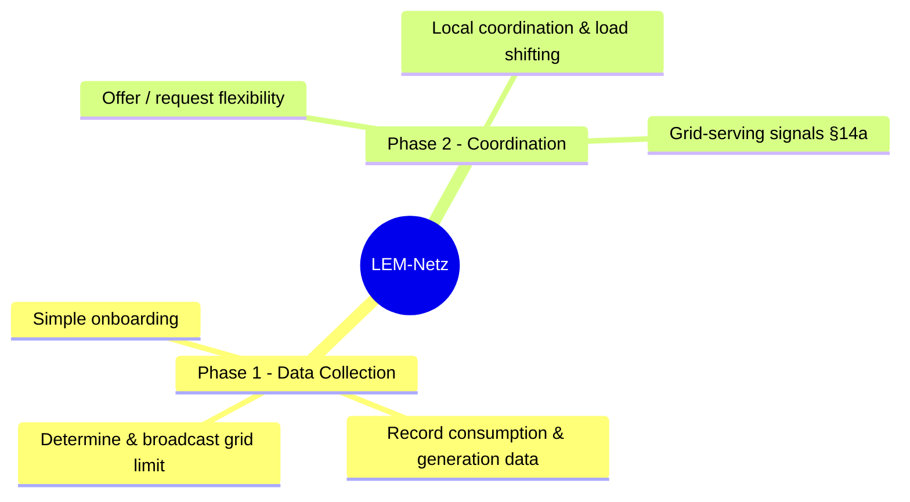

**Requirements Analysis and Use-Case Documentation: Decentralized LEM-Netz (Simplified Version)**

**Status:** Draft

### 1. Introduction and Purpose

The decentralized Local Energy Management System (LEM-Netz) enables neighborhoods to robustly and cost-effectively coordinate generation and consumption. It acts as a coordination and signaling layer between autonomous household energy management systems — each household retains full control over its own devices. The system prioritizes the protection of grid infrastructure and realizes economic benefits primarily through § 14a EnWG and optimized self-consumption. Formal balancing energy-sharing accounting is deliberately avoided to minimize complexity and additional regulatory hurdles.

### 2. Goals

- Highest priority: Ensuring grid infrastructure safety (transformers and lines).
- Increasing local self-consumption and load flexibility.
- Leveraging existing and future regulatory incentives (§ 14a EnWG).
- High robustness and self-governance capability.
- Low entry barriers and easy extensibility.
- Ensuring data sovereignty of participants.

### 2a. Priority Hierarchy

> **Infrastructure Safety > Economic Fairness**

1. **Infrastructure Safety (highest priority)**: The transformer and line limits are non-negotiable. When a conflict arises, all optimization is suspended to protect grid infrastructure.
2. **Economic Fairness**: Optimization must not financially disadvantage any household type. Every household must break even or benefit.
3. **If these conflict, infrastructure safety always wins.**

### 2b. Supported Household Types

| Type | Pricing Model | Optimization Goal |
|------|---------------|-------------------|
| No PV | Fixed tariff | Minimize consumption cost |
| PV only (EEG) | Fixed feed-in | Maximize self-consumption |
| PV only (Dynamic) | EPEX Spot | Shift consumption to low-price periods |
| PV + Battery | Dynamic | Arbitrage (charge low, discharge high) |
| Battery only | Dynamic | Arbitrage (charge cheap, discharge expensive) |
| Heat pump | §14a network charges | Shift to low-tariff periods |
| EV + Wallbox | Dynamic | Coordinate charging with price signals |
| EV + Wallbox + Heat pump + Battery | Mixed | Full optimization across all assets |
| Balcony solar (Balkonkraftwerk) | Self-consumption | Maximize generation, curtail if grid export limit exceeded |

### 3. Functional Requirements (FR)

**FR-01 Grid Infrastructure Protection (highest priority)**  
The system must periodically determine the maximum permissible net export/import limit for the neighborhood or affected grid branch and distribute it bindingly to all participants.

**FR-02 Measurement Data Acquisition**  
Provision of time-resolved consumption and generation data through a suitable, certified metering device. As a private individual, access to this measurement data must be possible.

**FR-03 Decentralized Agents**  
Each participant operates an autonomous agent that acts as a bridge between the neighborhood coordination layer and the household's existing energy management system (e.g., OpenEMS, evcc, Home Assistant). The agent processes local measurement data, offers or requests flexibility to the neighborhood, and forwards coordination signals (grid limits, flexibility requests, tariff or § 14a information) to the household's internal automation. Direct device control remains with the household's own EMS — the LEM agent never controls end devices such as inverters, heat pumps, or wallboxes directly.

**FR-04 Local Coordination**  
Support for coordinating local surplus and demand within applicable grid limits, mediated through household agents without direct device control. Coordination is achieved via signaling (grid limits, flexibility offers/requests, tariff information) — each household's EMS decides autonomously how to respond. No balancing accounting is performed.

**FR-05 Simple Onboarding**  
New participants must be able to integrate into the system without extensive administrative effort.

**FR-06 Economic Fairness**  
The optimization logic MUST NOT apply strategies that result in financial loss to any household compared to their baseline pricing model. Each household must have visibility into the financial impact of coordination decisions and the ability to opt out of participation.

**FR-07 Support for Grid-Serving Control**  
Provision of mechanisms for forwarding § 14a-compliant grid-serving signals (module 1/2/3) from the grid operator or neighborhood coordinator to each household's EMS. The household's own automation is responsible for implementing the control response.

### 4. Non-Functional Requirements

- **Robustness**: The system must be able to continue operating with reduced functionality during partial failures. The grid protection function has absolute priority.
- **Economic Efficiency**: Low investment and no recurring costs — see §4.1.

### 4.1 Cost Requirements

| Category | Target | Notes |
|----------|--------|-------|
| Per-household hardware (one-time) | €100–200 | Bridge device, sensors, installation materials |
| Central infrastructure (one-time) | ≤ €300 | Server + gateway, shared across the community |
| Recurring costs | €0 | No subscriptions, no annual fees — all software is open-source, EPEX Spot data is free |
- **Data Sovereignty and Privacy**: Local data processing in compliance with GDPR.
- **Scalability**: Support for a variable number of households in a neighborhood.
- **Simplicity**: Minimization of administrative and technical complexity.
- **Interoperability**: Compatibility with existing and future metering and control infrastructures.

### 5. System Overview

### 6. Detailed Use Cases

#### Phase 1 — Data Collection

- **UC-01 Determine & broadcast grid limit**: Periodic determination and distribution of the binding grid limit.
- **UC-02 Record consumption & generation data**: Provision of timely measurement values through suitable metering devices.
- **UC-05 Simple onboarding**: New participants can register via a self-service process with minimal configuration and are automatically recognized by the system.

#### Phase 2 — Coordination

- **UC-03 Offer / request flexibility**: The household agent advertises available flexibility or signals demand to the neighborhood coordinator. The household's own EMS decides whether and how to fulfill flexibility requests.
- **UC-04 Local coordination & load shifting**: Coordination of flexibility between autonomous household systems via signaling. When grid limits are breached, the coordinator broadcasts a load-shed signal with this recommended priority order: EV wallbox → battery charging → heat pump. Each household's EMS decides how to respond. Balcony solar (Balkonkraftwerk) curtailment follows the same signaling principle if reverse power flow limits are exceeded.
- **UC-06 Grid-serving signals**: Forwarding of § 14a-compliant grid-serving signals (module 1/2/3) from grid operator or coordinator to each household's EMS for autonomous implementation.

### 7. Sources

1. Gesetz über die Elektrizitäts- und Gasversorgung (Energiewirtschaftsgesetz - EnWG), § 14a – Netzorientierte Steuerung von steuerbaren Verbrauchseinrichtungen und steuerbaren Netzanschlüssen.  
   [https://www.gesetze-im-internet.de/enwg_2005/__14a.html](https://www.gesetze-im-internet.de/enwg_2005/__14a.html)

2. Bundesnetzagentur. Festlegungsverfahren zur Integration von steuerbaren Verbrauchseinrichtungen und steuerbaren Netzanschlüssen nach § 14a EnWG.  
   [https://www.bundesnetzagentur.de/enwg14a](https://www.bundesnetzagentur.de/enwg14a)

3. Gesetz über den Messstellenbetrieb und die Datenkommunikation in intelligenten Energienetzen (Messstellenbetriebsgesetz - MsbG).  
   [https://www.gesetze-im-internet.de/messbg/](https://www.gesetze-im-internet.de/messbg/)

4. Bundesnetzagentur. Informationen zur netzorientierten Steuerung und Netzentgeltreduzierung nach § 14a EnWG.  
   [https://www.bundesnetzagentur.de/DE/Vportal/Energie/SteuerbareVBE/start.html](https://www.bundesnetzagentur.de/DE/Vportal/Energie/SteuerbareVBE/start.html)

---

**Two-Pager: Decentralized LEM-Netz – Neighborhood Energy Management**

**Page 1 – System Description**

The decentralized LEM-Netz is a simple, robust coordination and signaling layer for local coordination of electricity generation and consumption in residential neighborhoods. It connects autonomous household energy management systems, based on suitable metering devices, decentralized bridge agents, and clear priority rules. The LEM never controls end devices directly — each household retains full autonomy over its own installations.

**Core functions**:
- Continuous monitoring and adherence to grid limits to protect local infrastructure.
- Coordinated use of generation surpluses and consumption flexibility.
- Support for grid-serving operation of controllable installations.

The system avoids complex billing mechanisms and focuses on practical, immediately usable benefits. It is designed to start with existing installations and be expanded incrementally.

**Why does implementation make sense?**  
The ongoing energy transition is leading to increasing decentralized generation and electrification of the heating and transport sectors. This significantly increases the load on low-voltage grids. Local coordination mechanisms can reduce grid congestion without costly grid expansion. At the same time, they enable households to realize direct economic benefits through optimized self-consumption and regulatory incentives such as § 14a EnWG.

**Page 2 – Advantages, Disadvantages, and Assessment**

**Advantages**:
- **Economic**: Utilization of grid fee reductions according to § 14a EnWG and increase in self-consumption share.
- **Technically robust**: High reliability through decentralized structure and graceful degradation.
- **Regulatory compliant**: No dependency on certified sharing metering systems; compatibility with current legal frameworks.
- **Practical**: Low entry barriers and use of existing metering infrastructure.
- **Future-proof**: Solid foundation for later regulatory developments.

**Disadvantages**:
- Limited monetary benefit when few controllable consumption devices are available.
- Dependence on the grid operator's willingness to cooperate for full § 14a benefits.
- Initial organizational effort within the neighborhood.

**Overall assessment**:  
The decentralized LEM-Netz represents a pragmatic and sensible approach. It addresses real physical and economic challenges of the energy transition at the neighborhood level, without requiring excessive complexity or high investment. In a phase of increasing grid load and grid fees, it offers a concrete contribution to local resilience, cost reduction, and efficient use of existing infrastructure.

**Recommendation**: Start with a small pilot project to validate the practical effectiveness of grid protection and flexibility coordination.

**Sources (Two-Pager)**  
See detailed sources in the requirements analysis (Section 7).
