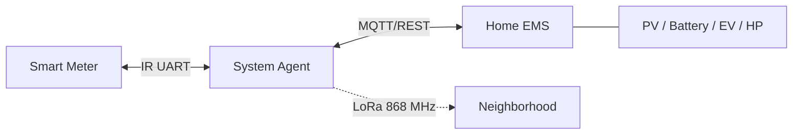

# Local Energy Coordination

> Grid-aware coordination for residential energy systems.

An experimental open-source project exploring how residential loads — EV chargers, batteries, heat pumps, PV surplus — can be coordinated locally to reduce stress on low-voltage distribution grids. No energy trading, no cloud dependency, no billing.

---

## Why This Matters

More PV + EV chargers + heat pumps = synchronized peaks that low-voltage networks weren't designed for. Overloaded transformers, voltage instability, expensive upgrades. Often the problem isn't total demand — it's lack of coordination.

---

## Architecture

**Phase 1** — Individual grid limits enforced locally. No inter-household communication needed.  
**Phase 2** — Optional neighborhood coordination (flex offers, load shedding). Phase 1 limits remain the hard ceiling.  
**Invariant:** Infrastructure safety > economic fairness. Load shed order: wallbox → battery charging → heat pump.  
**Regulatory context:** German §14a EnWG (grid-serving control) — the system coexists with it but is not in the signal path and requires no certification. Formal §14a integration is a long-term option dependent on grid operator cooperation, not current scope. See [Brainstorming.md](Brainstorming.md).

---

## Technical Direction

| Layer | Choice |
|-------|--------|
| Transport | LoRa 868 MHz + MQTT |
| Agent HW | ESP32-S3 + LoRa (LilyGO T3 S3) |
| Meter I/F | WattWächter TTL, SML over UART |
| Build | PlatformIO + Arduino ESP32 core |
| LoRa | RadioLib |
| Scalability | 100+ households / neighborhood |
| Cost | ~€48–55 one-time, €0 recurring |

---

## Repository

| File | Content |
|------|---------|
| [`Requirements.md`](Requirements.md) | Requirements, use cases, priority hierarchy |
| [`Brainstorming.md`](Brainstorming.md) | Architecture, protocol, hardware evaluation, open decisions |
| [`prototype-build.md`](prototype-build.md) | BOM, circuit, PlatformIO flashing guide |
| [`AGENTS.md`](AGENTS.md) | Architecture invariants & constraints (AI agent reference) |
| [`20260517 AI review/Claude.md`](20260517%20AI%20review/Claude.md) | External review — concrete errors in build plan |
| [`20260517 AI review/Grok.md`](20260517%20AI%20review/Grok.md) | External review — feasibility assessment |

---

## Open Decisions

From [Brainstorming §8](Brainstorming.md#8-open-questions):

| Question | Status |
|----------|--------|
| Communication medium (LoRa vs MQTT vs hybrid) | Open |
| Coordinator placement | Phase 1: none; Phase 2: open |
| Flex matching algorithm | Open |
| Data retention policy | Open |

---

## Principles

- **Local first** — works without internet
- **Simple & predictable** — understandable over opaque
- **Incremental** — small improvements over full automation
- **Grid-aware** — infrastructure limits always respected
- **Interoperable** — standards-based where practical

---

## Status

Early architecture and prototyping phase. Specification only — no implementation code.

---

## Contributing

Feedback from: low-voltage infrastructure, embedded systems, MQTT/LoRa, energy management, operational safety.

---

## Disclaimer

Experimental research project. Not for production-critical infrastructure without proper validation.
