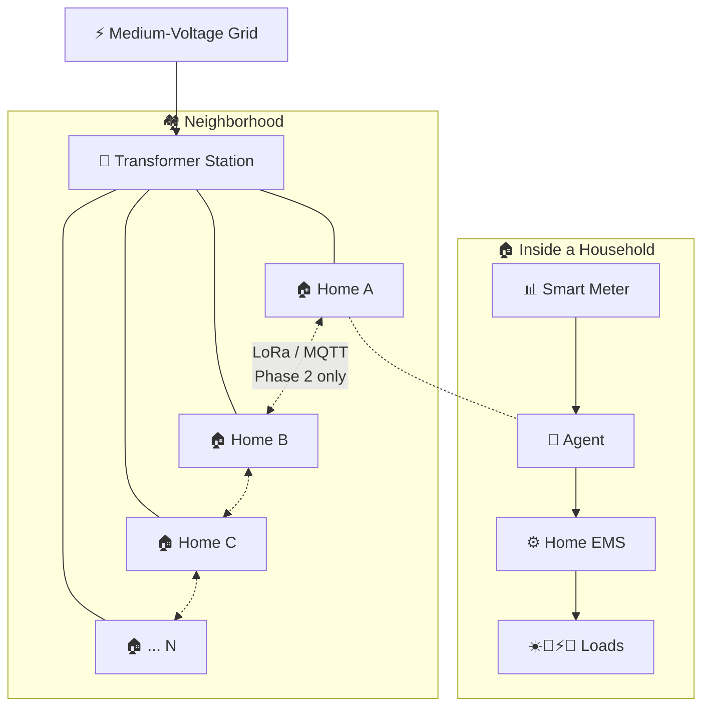
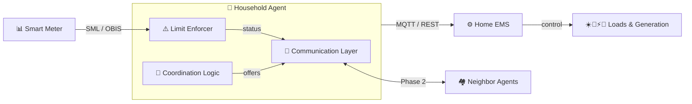

# Local Energy Coordination

> Reducing transformer peaks through local coordination — respecting each household's individual pricing model.

An experimental open-source project exploring how residential loads — EV chargers, batteries, heat pumps, PV surplus — can be coordinated locally to reduce stress on low-voltage distribution grids. No energy trading between households, no cloud dependency, no billing. Each household keeps full control over its own devices and pricing — coordination never forces an action that financially disadvantages a household relative to its baseline (FR-06).

---

## Why This Matters

More PV + EV chargers + heat pumps = synchronized peaks that low-voltage networks weren't designed for. Overloaded transformers, voltage instability, expensive upgrades. Often the problem isn't total demand — it's lack of coordination. The goal isn't controlling when homes consume — it's preventing simultaneous peaks while keeping every household's economics whole.

---

## Architecture

### Physical Topology

### Software Architecture

**Phase 1** — Individual grid limits enforced locally (Limit Enforcer). No inter-household communication needed.  
**Phase 2** — Optional neighborhood coordination (flex offers, load shedding) via the Communication Layer. Phase 1 limits remain the hard ceiling.  
**Invariant:** Infrastructure safety > economic fairness. Load shed order: wallbox → battery charging → heat pump. The Limit Enforcer is always active, independent of Phase 2.  
**Regulatory context:** German §14a EnWG (grid-serving control) — the system coexists with it but is not in the signal path and requires no certification. Formal §14a integration is a long-term option dependent on grid operator cooperation, not current scope. See [Brainstorming.md](Brainstorming.md).

---

## Economic Constraint (FR-06)

Every household must break even or benefit compared to its baseline without the system. Coordination signals (load shed, curtailment, shift requests) must never cause financial loss for any household.

This is **unsolved** — no comparison algorithm or data structure is defined yet. See [Requirements.md §2b](Requirements.md#2b-supported-household-types) for the 10 supported household types and their distinct pricing models (fixed tariff, EEG feed-in, dynamic/EPEX Spot, §14a), each with different optimization goals.

Designing the fairness mechanism is required before Phase 2 implementation.

---

## Technical Direction

| Layer | Choice |
|-------|--------|
| Transport | LoRa 868 MHz + MQTT |
| Agent HW | ESP32-S3 + LoRa (LilyGO T3 S3) |
| Meter I/F | WattWächter TTL, SML over UART |
| Build | PlatformIO + Arduino ESP32 core |
| LoRa | RadioLib |
| Scalability | 100+ households / neighborhood |
| Cost | ~€48–55 one-time, €0 recurring |

---

## Repository

| File | Content |
|------|---------|
| [`Requirements.md`](Requirements.md) | Requirements, use cases, priority hierarchy |
| [`Brainstorming.md`](Brainstorming.md) | Architecture, protocol, hardware evaluation, open decisions |
| [`prototype-build.md`](prototype-build.md) | BOM, circuit, PlatformIO flashing guide |
| [`AGENTS.md`](AGENTS.md) | Architecture invariants & constraints (AI agent reference) |
| [`20260517 AI review/Claude.md`](20260517%20AI%20review/Claude.md) | External review — concrete errors in build plan |
| [`20260517 AI review/Grok.md`](20260517%20AI%20review/Grok.md) | External review — feasibility assessment |

---

## Open Decisions

From [Brainstorming §8](Brainstorming.md#8-open-questions):

| Question | Status |
|----------|--------|
| Communication medium (LoRa vs MQTT vs hybrid) | Open |
| Coordinator placement | Phase 1: none; Phase 2: open |
| Flex matching algorithm | Open |
| Data retention policy | Open |

---

## Principles

- **Local first** — works without internet
- **Simple & predictable** — understandable over opaque
- **Incremental** — small improvements over full automation
- **Grid-aware** — infrastructure limits always respected
- **Interoperable** — standards-based where practical

---

## Status

Early architecture and prototyping phase. Specification only — no implementation code.

---

## Contributing

Feedback from: low-voltage infrastructure, embedded systems, MQTT/LoRa, energy management, operational safety.

---

## Disclaimer

Experimental research project. Not for production-critical infrastructure without proper validation.
