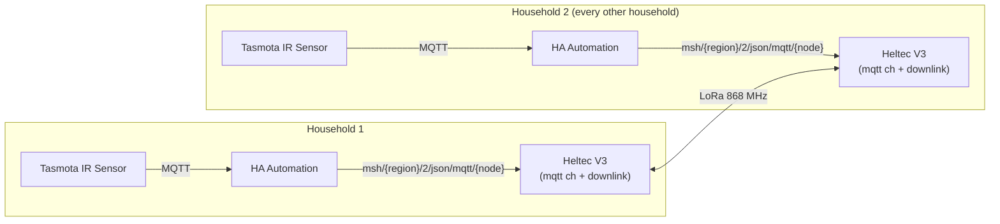
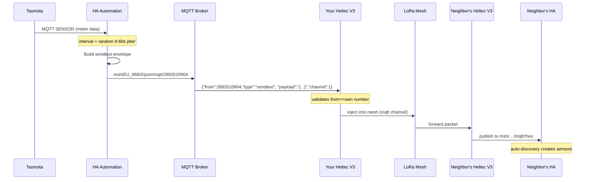

# HA Setup — Per-Household LoRa Data Sharing

Every household runs its own Home Assistant + MQTT broker. Each Heltec V3 has the `mqtt` channel with downlink enabled. Each HA publishes its own meter data into the LoRa mesh using its own node's decimal number — no single point of failure, no extra hardware beyond the node and Tasmota sensor.



**LoRa is the only inter-household link.** No shared MQTT broker, no shared WiFi between houses, no VPN, no bridge scripts.

---

## Prerequisites

- Heltec V3 flashed with stock Meshtastic and connected to your local MQTT broker ([mesh-setup.md](mesh-setup.md))
- MQTT broker running in your Home Assistant instance (Mosquitto add-on or standalone)
- Your node's decimal number and hex ID from the Meshtastic Web UI (**About** page)

---

## Quick Start

### Step 1 — Install Sender Blueprint

1. In HA: **Settings → Automations → Blueprints → Import Blueprint**
2. Paste this URL and click **Import**:
   `https://raw.githubusercontent.com/FunCyRanger/LOTSE/refs/heads/main/sender-blueprint.yaml`
3. Click **Create Automation**, fill in the form:
   - **Node Number** — from the Web UI (required)
   - **LoRa Region** — pre-filled to `EU_868`, change for your country (required)
   - **Grid Import Power (gIP)** — pick your sensor (required)
   - **MQTT Channel** — pre-filled to 1 (required)
   - All other fields are optional — leave empty to exclude from the payload
4. Save — your node publishes on the next interval automatically

### Step 1b — Install Config Blueprint (recommended)

This sends your node's static system configuration (battery capacity, solar peak power, panel angle, azimuth) into the mesh so neighbors can compute capacity-weighted SOC and solar utilization. Sent on HA startup and once daily at a configurable hour.

1. Import the blueprint:
   `https://raw.githubusercontent.com/FunCyRanger/LOTSE/refs/heads/main/sender-config-blueprint.yaml`
2. Click **Create Automation**, fill in:
   - **Node Number** and **LoRa Region** — same as Step 1
   - **Battery Capacity (kWh)** — total battery capacity (leave empty if none)
   - **Solar Peak Power (kWp)** — total installed PV peak power (leave empty if none)
   - **Panel Angle / Azimuth** — optional, for solar normalization
3. Save. The config message publishes within 60 seconds and then daily at the configured hour.

> **Tip:** After changing config values, restart HA to send the updated config immediately. Or use **Settings → Automations → click the config automation → Save** to re-trigger it.

### Step 2 — Install Auto-Discovery

1. Copy or download [`auto-discovery-automation.yaml`](auto-discovery-automation.yaml)
2. In HA: **Settings → Automations → Create Automation → Edit in YAML**, paste and save

No edits needed — the automation extracts the region from the MQTT topic dynamically. Neighbor sensors appear automatically when the first message arrives.

### Step 3 — Install Combined Sensors (optional)

This step creates aggregated sensors that sum up all neighbors into a single reading. The three cumulative-energy sensors can be added to the Energy Dashboard once and never need updating — new neighbors are included automatically.

**What it creates** (16 sensors):

| Sensor name | Source keys | What it shows | Energy Dashboard |
|---|---|---|---|---|
| Combined Mesh Grid Power | `gP` | Net neighborhood power (+import, −export) | — |
| Combined Mesh Grid Import Power | `gIP` | Sum of import power | — |
| Combined Mesh Grid Export Power | `gEP` | Sum of export power | — |
| Combined Mesh Solar Power | `sP` | Total solar generation | — |
| Combined Mesh Total Solar Generation | `sP` | Same, alias for clarity | — |
| Average Neighbor SOC | `bS` | Average battery level across all neighbors | — |
| Weighted Average SOC | `bS`, `bC` | Capacity-weighted SOC (weighted by battery kWh) | — |
| Combined Self-Consumption Rate | `sP`, `gEP` | % of solar consumed locally (no grid export) | — |
| Participating Neighbors | `gIP` | Number of neighbors currently reporting | — |
| Combined Mesh Battery Capacity | `bC` | Total battery capacity in kWh across all nodes | — |
| Combined Mesh Solar Capacity | `sK` | Total installed solar peak power in kWp | — |
| Combined Solar Utilization | `sP`, `sK` | % of installed PV capacity currently generated | — |
| Config-Ready Nodes | `bC` | Number of nodes that have reported config data | — |
| Combined Mesh Grid Import | `gEI` | Cumulative import energy | ✅ |
| Combined Mesh Grid Export | `gEO` | Cumulative export energy | ✅ |
| Combined Mesh Solar Energy | `sE` | Cumulative solar energy | ✅ |

**Installation:**

*Option A — Add to `configuration.yaml` (recommended):*

1. Open your HA `configuration.yaml` (via Studio Code Server, Samba, or the File Editor add-on).
2. Add this line at the end:
   ```yaml
   template: !include mesh-combined-sensors.yaml
   ```
3. Copy [`mesh-combined-sensors.yaml`](mesh-combined-sensors.yaml) into the same folder as `configuration.yaml`.
4. Restart Home Assistant.
5. The 11 sensors appear in **Settings → Devices & Services → Entities** (search "Combined Mesh").

*Option B — Packages folder:*

If you already use `packages: !include_dir_named packages` in your `configuration.yaml`, drop the file into the `packages/` folder and restart.

---

**Optional: Dashboard (see all 11 sensors on one page)**

HA does not support grouping YAML-defined template sensors under a device, so the sensors appear as individual entities. To view them all at a glance, import the LOTSE dashboard:

1. Copy [`lotse-dashboard.yaml`](lotse-dashboard.yaml) to your HA `config/` folder.
2. In HA: **Settings → Dashboards → Import** → pick the file → **Import**.
3. A new tab **"LOTSE Neighborhood"** appears in your sidebar with all sensors grouped by category (Grid Power, Solar, Grid Cumulative Energy, Neighborhood).

> **Tip:** The three cumulative-energy sensors are the ones to add to the Energy Dashboard (see section below). The config-derived sensors (Weighted SOC, Solar Capacity, etc.) populate as nodes install the config blueprint and send their registration data.

> **Prerequisite:** At least one neighbor must have sent data so the individual `node_XXXX_*` sensors exist.

### Step 4 — Verify

After the first send interval (default 5 minutes, plus a random 0–60 s delay) elapses:
- Neighbor sensors appear under **Settings → Devices & Services → Devices**
- Combined sensors appear under **Settings → Devices & Services → Entities** (search "Combined Mesh")
- If you imported the dashboard, a new **LOTSE Neighborhood** tab appears in your sidebar showing all combined sensors on one page
- The **Energy** dashboard shows your first recorded data point

New neighbors that join later are handled automatically — no additional setup needed.

---

## Expected Message Flow

### Send direction

```
HA publishes to:        msh/EU_868/2/json/mqtt/2892010904
Payload (JSON):
  {"from": 2892010904, "type": "sendtext",
   "payload": "{\"gP\":-1.2,\"gP1\":-0.4,\"gP2\":-0.4,\"gP3\":-0.4,\"bS\":85,\"sP\":3.5}",
   "channel": 1}

Your node receives MQTT:
  ✅ "from" == 2892010904 (matches own number)
  ✅ channel is "mqtt" with downlink
  ✅ injects into LoRa mesh on mqtt channel
```

### Receive direction

```
LoRa message arrives at your node:
  from: 2712679380 (neighbor's decimal)
  payload: {"gP": -1.2, "gP1": -0.4, "gP2": -0.4, "gP3": -0.4, "bS": 85, "sP": 3.5}

Your node publishes to MQTT:
  Topic: msh/EU_868/2/json/mqtt/!your_node_hex
  Payload: {"from": 2712679380, "type": "text",
            "payload": {"gP": -1.2, "gP1": -0.4, "gP2": -0.4, "gP3": -0.4, "bS": 85, "sP": 3.5},
            "channel": 1, ...}

Your HA receives it, checks from == NEIGHBOR_DECIMAL,
  value_json.payload.gP → sensor value
```



---

## Data Format

JSON payload with keys grouped by category. Sign convention: import/charge = positive, export/discharge = negative.

### Grid

| Key | Meaning | Unit | Priority |
|-----|---------|------|----------|
| gP | Net power (+import, -export) | kW | important |
| gIP | Import power only (always ≥0) | kW | **required** |
| gEP | Export power only (always ≥0) | kW | important |
| gP1 | Phase 1 power | kW | important |
| gP2 | Phase 2 power | kW | important |
| gP3 | Phase 3 power | kW | important |
| gV1 | Phase 1 voltage | V | optional |
| gV2 | Phase 2 voltage | V | optional |
| gV3 | Phase 3 voltage | V | optional |
| gEI | Cumulative energy import | kWh | **important** |
| gEO | Cumulative energy export | kWh | **important** |

### Solar

| Key | Meaning | Unit | Priority |
|-----|---------|------|----------|
| sP | Power | kW | important |
| sE | Cumulative energy | kWh | important |

### Battery

| Key | Meaning | Unit | Priority |
|-----|---------|------|----------|
| bP | Power (+charge, -discharge) | kW | important |
| bS | State of charge | % | optional |
| bEI | Cumulative energy in | kWh | optional |
| bEO | Cumulative energy out | kWh | optional |

### Wallbox (EV charger)

| Key | Meaning | Unit | Priority |
|-----|---------|------|----------|
| wP | Power | kW | optional |
| wE | Cumulative energy | kWh | optional |
| wS | State of charge | % | optional |

**Minimal payload (grid-only, just the required field):**
```
{"gIP": 1.5}
```

**Example payload (all keys):**
```
{"gP":-1.2,"gIP":0.0,"gEP":1.2,"gP1":-0.4,"gP2":-0.4,"gP3":-0.4,"gV1":230.0,"gV2":229.0,"gV3":231.0,"gEI":12.5,"gEO":3.2,"sP":3.5,"sE":15.2,"bP":1.0,"bS":85,"bEI":8.5,"bEO":2.3,"wP":0.0,"wE":2.1,"wS":80}
```

**Size:** ~200 bytes with all keys, ~12 bytes with just `gIP` — both fit within Meshtastic's ~220-byte limit.

**Edge cases:**
- Sensors with state `unavailable`, `unknown`, `none`, `NaN`, `inf` are **omitted** from the payload (no key sent)
- Power values are **clamped** to ±500 kW — guards against sensor glitches or unit mismatches (e.g., kWh sensor wired to a kW slot)
- Energy values (`gEI`, `gEO`, `sE`, `bEI`, `bEO`, `wE`) are **clamped** at ≥ 0 — negative cumulative energy is rejected
- Battery/Wallbox SOC is **clamped** to 0–100%
- **Unit mismatch detection**: If a sensor's `unit_of_measurement` belongs to the wrong category (e.g., `kWh` in a power slot, `kW` in an energy slot), the key is omitted. If no unit is set, the value passes through as-is

---

## Energy Dashboard

The Energy Dashboard tracks cumulative import/export/solar per household.

### Linking sensors — option A: combined sensors (recommended)

If you installed the combined sensors (Quick Start Step 3), add these to the Energy Dashboard. New neighbors are included automatically — no manual updates needed.

| Dashboard slot | Add sensor (entity) |
|---|---|
| Grid consumption | `Combined Mesh Grid Import` |
| Return to grid | `Combined Mesh Grid Export` |
| Solar production | `Combined Mesh Solar Energy` |

### Linking sensors — option B: per-neighbor (without combined sensors)

Each neighbor's cumulative sensors appear automatically (e.g., `Node 2892019402 gEI`, `Node 2892019402 gEO`, `Node 2892019402 sE`). In **Settings → Energy**:

| Dashboard slot | Add each neighbor's sensor |
|---------------|---------------------------|
| Grid consumption | `Node {NUMBER} gEI` (cumulative import energy) |
| Return to grid | `Node {NUMBER} gEO` (cumulative export energy) |
| Solar production | `Node {NUMBER} sE` (cumulative solar energy) |

New neighbors must be added manually when they join — there is no auto-discovery for the Energy Dashboard.

### Sign convention

Import = positive, export = negative:
- `gEI` and `gIP` are always ≥0
- `gEO` and `gEP` are always ≥0
- `sE` is always ≥0
- No sign adjustment needed

### Optional: per-household metadata

Normalize solar output or track battery capacity across neighbors. Create one `input_number` helper per neighbor per field via **Settings → Helpers**:

| Helper | Purpose | Value |
|--------|---------|-------|
| `input_number.node_{NUMBER}_solar_kwp` | PV system peak power | e.g. 5.0 kWp |
| `input_number.node_{NUMBER}_battery_kwh` | Battery capacity | e.g. 10 kWh |

Then create a template sensor to show solar utilization as % of peak power:

```jinja


{{ (sP / kwp * 100) | round(1) }}
```

This normalizes across households: a 3 kWp system at 2 kW and a 6 kWp system at 4 kW both read 67%.

**Solar forecast** (Solcast, PVOutput) is a separate HA integration, not related to the mesh payload.

---

## Adding More Households

| Step | What to do |
|------|-----------|
| New neighbor joins | Configure their Heltec V3 per [mesh-setup.md](mesh-setup.md) and install the sender blueprint |
| Existing households see them | Auto-discovery creates sensors automatically from the first received message |
| No changes needed on the mesh | The new node is already on the shared LoRa channel; all existing nodes will receive its messages automatically |

---

## Troubleshooting

| Symptom | Likely cause | Fix |
|---------|-------------|------|
| Blueprint import fails with "invalid config" | Node number or sensor fields have wrong types | Ensure Node Number is a plain decimal (no quotes). Check sensor entities exist and are numeric. |
| Sensors don't appear after first message | Auto-discovery not running | Verify `auto-discovery-automation.yaml` is saved and enabled in HA → Automations. Check MQTT topic `msh/{region}/2/json/mqtt/!{your_hex}` for incoming messages (Mosquitto add-on → Listen). |
| Neighbor sensor not listed in Energy Dashboard | Dashboard only shows `total_increasing` sensors | Auto-discovery sets this automatically. If the sensor exists but is missing from the dropdown, check its state class in **Settings → Devices & Services → Devices**. |
| Energy dashboard shows gaps | Send interval too long | In the sender blueprint, adjust "Send interval" (default 5 min) to 2 min. Note this increases LoRa channel usage. |
| Neighbor values are stale | Node went offline or LoRa range issue | Check neighbor's node is still powered. Increase send interval. Verify both nodes are within LoRa range (~1-2 km urban, more rural). |
