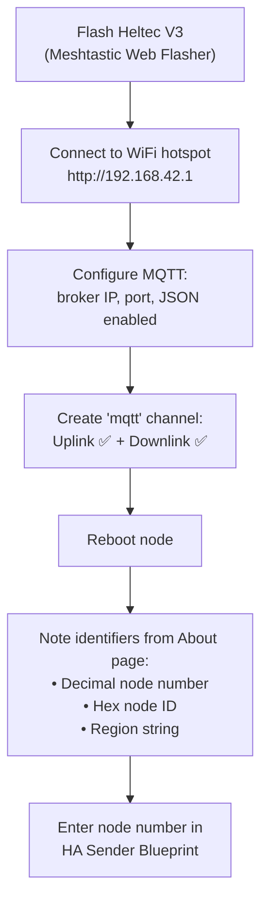

# Mesh Setup — Heltec V3 Configuration

First: flash the Heltec V3 ([Flashing](#flashing) below). Then set up Home Assistant per [ha-setup.md](ha-setup.md). Finally, return here to configure MQTT and channels in the Web UI.

This guide assumes basic familiarity with LoRaWAN and MQTT concepts. If you haven't worked with Meshtastic before, here's what you need to know:

- **Meshtastic** — an open-source LoRa mesh firmware for ESP32 boards. Devices form a low-bandwidth mesh network that can carry small JSON messages over kilometers.
- **MQTT** — the protocol used between Home Assistant and the Heltec V3. Your HA publishes meter data to a local MQTT broker; the node subscribes to it and relays the message into the LoRa mesh.
- **Node number** — every Meshtastic node has a unique decimal identifier (e.g. `2892010904`). This number goes in the `from` field of every message so receivers can tell which household sent it.

## What you need

| Item | Notes |
|------|-------|
| Heltec V3 (ESP32-S3 + SX1262 868 MHz) | One per household |
| Tasmota-compatible IR reader | Reads smart meter via optical interface |
| USB-C cable + power supply | Existing phone charger works |

## Flashing

Use the [Meshtastic Web Flasher](https://flasher.meshtastic.org/) — no local tools needed. Select **Heltec V3**, flash the latest stable release. No custom firmware fork required.

## Node Configuration (Web UI)

After flashing, connect to the node's WiFi hotspot and open the Web UI (typically `http://192.168.42.1`).

### MQTT Settings

| Field | Value |
|-------|-------|
| MQTT Enabled | ✅ Check |
| Address | Your local MQTT broker IP (e.g., `192.168.1.100`) |
| Port | `1883` |
| JSON Output Enabled | ✅ Check |
| Username/Password | If your broker requires auth |
| TLS | Uncheck (local network) |

### Channel Configuration

This dedicated `mqtt` channel carries your meter data separately from the default LongFast mesh traffic. The separation keeps low-priority sensor chatter off the primary mesh channel.

| Channel | Role | Uplink | Downlink |
|---------|------|--------|----------|
| `mqtt` (index 1) | All meter data | ✅ **Check this** | ✅ **Check this** |

Create a **new** channel with these settings:

| Setting | Value |
|---------|-------|
| Name | **`mqtt`** (exactly this, lowercase) |
| PSK | Default/random |
| Uplink Enabled | ✅ Check |
| Downlink Enabled | ✅ Check |

**Reboot the node** — channel changes don't take effect until reboot.

### Find Your Node Number

From Web UI → **About** page, note both:

| Identifier | Example | Used for |
|------------|---------|----------|
| Decimal Node Number | `2892010904` | `from` field in the sender automation |
| Hex Node ID | `!acaad598` | MQTT topic path for received messages |
| Region string | `EU_868` | Part of the MQTT topic |

---

## Troubleshooting

| Symptom | Likely cause | Fix |
|---------|-------------|-----|
| Web UI doesn't load after connecting to hotspot | Wrong IP or browser cache | Open `http://192.168.42.1` (not `https`). Clear browser cache or use private tab. |
| Node doesn't connect to MQTT | Wrong broker address or port | Verify broker IP and port in Web UI → MQTT config. Test with `mosquitto_pub` from another machine if possible. |
| Messages not appearing in LoRa mesh | Channel downlink unchecked | Go to Channels → edit `mqtt` channel → check **Downlink Enabled**, then reboot. |
| Messages published but neighbors don't see them | No trailing `/` after `mqtt` in Meshtastic MQTT root topic | In the Meshtastic Web UI → MQTT config, set the root topic to `msh/{region}/2/json/mqtt/` — the trailing `/` after `mqtt` is required. The HA blueprint publishes the full topic including your node number. |
| Node number changes after reflash | Fresh flash generates a new key | Note the decimal number from Web UI → About and update your sender blueprint. |
